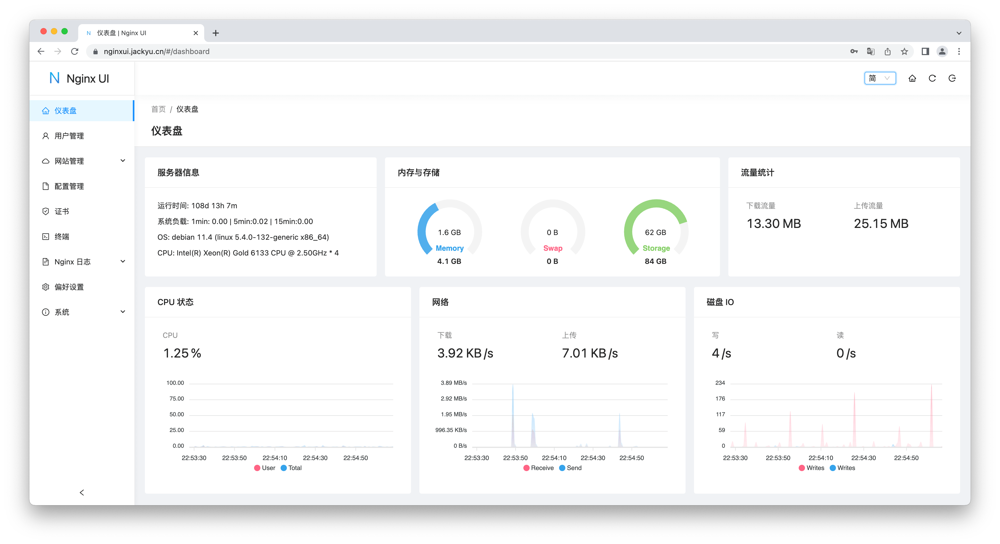

<div align="center">
      
</div>

# Nginx UI

Yet another Nginx Web UI

Nginx 网络管理界面，由  [0xJacky](https://jackyu.cn/) 与 [Hintay](https://blog.kugeek.com/) 开发。

[](https://github.com/0xJacky/nginx-ui/actions/workflows/build.yml)

[For English](README.md)

[繁體中文](README-zh_TW.md)

<details>
  <summary>目录</summary>
  <ol>
    <li>
      <a href="#关于项目">关于项目</a>
      <ul>
        <li><a href="#特色">特色</a></li>
        <li><a href="#国际化">国际化</a></li>
        <li><a href="#构建基于">构建基于</a></li>
      </ul>
    </li>
    <li>
      <a href="#入门指南">入门指南</a>
      <ul>
        <li><a href="#使用前注意">使用前注意</a></li>
        <li><a href="#安装">安装</a></li>
        <li>
          <a href="#使用方法">使用方法</a>
          <ul>
            <li><a href="#通过执行文件运行">通过执行文件运行</a></li>
            <li><a href="#使用-systemd">使用 Systemd</a></li>
            <li><a href="#使用-Docker">使用 Docker</a></li>
          </ul>
        </li>
      </ul>
    </li>
    <li>
      <a href="#手动构建">手动构建</a>
      <ul>
        <li><a href="#依赖">依赖</a></li>
        <li><a href="#构建前端">构建前端</a></li>
        <li><a href="#构建后端">构建后端</a></li>
      </ul>
    </li>
    <li>
      <a href="#linux-安装脚本">Linux 安装脚本</a>
      <ul>
        <li><a href="#基本用法">基本用法</a></li>
        <li><a href="#更多用法">更多用法</a></li>
      </ul>
    </li>
    <li><a href="#nginx-反向代理配置示例">Nginx 反向代理配置示例</a></li>
    <li><a href="#贡献">贡献</a></li>
    <li><a href="#开源许可">开源许可</a></li>
  </ol>
</details>

## 关于项目



### 在线预览
网址：[https://nginxui.jackyu.cn](https://nginxui.jackyu.cn)
- 用户名：admin
- 密码：admin

### 特色

- 在线查看服务器 CPU、内存、系统负载、磁盘使用率等指标
- 一键申请和自动续签 Let's encrypt 证书
- 在线编辑 Nginx 配置文件，编辑器支持 Nginx 配置语法高亮
- 使用 Go 和 Vue 开发，发行版本为单个可执行的二进制文件
- 保存配置文件后自动测试配置文件并重载 Nginx
- 基于 Web 浏览器的高级命令行终端
- 前端支持暗夜模式
- 前端支持屏幕自适应

### 国际化

- 英语
- 简体中文
- 繁体中文

我们欢迎您将项目翻译成任何语言。

### 构建基于

- [The Go Programming Language](https://go.dev/)
- [Gin Web Framework](https://gin-gonic.com)
- [GORM](http://gorm.io/index.html)
- [Vue 2](https://vuejs.org)
- [vue-gettext](https://github.com/Polyconseil/vue-gettext)

## 入门指南

### 使用前注意

Nginx UI 遵循 Nginx 的标准，创建的网站配置文件位于 Nginx 配置目录（自动检测）下的 `sites-available` 目录，
启用后的网站的配置文件将会创建一份软连接到 `sites-enabled`
目录中。因此，您可能需要提前调整配置文件的组织方式。

### 安装

Nginx UI 可在以下平台中使用：

- Mac OS X 10.10 Yosemite 及之后版本（amd64 / arm64）
- Linux 2.6.23 及之后版本（x86 / amd64 / arm64 / armv5 / armv6 / armv7）
  - 包括但不限于 Debian 7 / 8、Ubuntu 12.04 / 14.04 及后续版本、CentOS 6 / 7、Arch Linux
- FreeBSD
- OpenBSD
- Dragonfly BSD
- Openwrt

您可以在 [最新发行 (latest release)](https://github.com/0xJacky/nginx-ui/releases/latest) 中下载最新版本，或使用 [Linux 安装脚本](#scripts-for-linux).

### 使用方法

第一次运行 Nginx UI 时，请在浏览器中访问 `http://<your_server_ip>:<listen_port>/install` 完成后续配置。

#### 通过执行文件运行
**在终端中运行 Nginx UI**

```shell
nginx-ui -config app.ini
```
在终端使用 `Control+C` 退出 Nginx UI。

**在后台运行 Nginx UI**

```shell
nohup ./nginx-ui -config app.ini &
```
使用以下命令停止 Nginx UI。

```shell
kill -9 $(ps -aux | grep nginx-ui | grep -v grep | awk '{print $2}')
```
#### 使用 Systemd
如果你使用的是[Linux 安装脚本](#scripts-for-linux)，Nginx UI 将作为 `nginx-ui` 服务安装在 systemd 中。请使用 `systemctl` 命令控制。

**启动 Nginx UI**

```shell
systemctl start nginx-ui
```
**停止 Nginx UI**

```shell
systemctl stop nginx-ui
```
**重启 Nginx UI**

```shell
systemctl restart nginx-ui
```

## 使用 Docker

Docker 示例
- `uozi/nginx-ui:latest` 镜像基于 `nginx:latest` 构建，
您可以直接将该镜像监听到 80 和 443 端口以取代宿主机上的 Nginx

- 映射到 `/etc/nginx` 的文件夹应该为一个空目录

```
docker run -dit \
  --name=nginx-ui \
  --restart=always \
  -e TZ=Asia/Shanghai \
  -v /mnt/user/appdata/nginx:/etc/nginx \
  -v /mnt/user/appdata/nginx-ui:/etc/nginx-ui \
  -p 8080:80 -p 8443:443 \
  uozi/nginx-ui:latest
```

## 手动构建

对于没有官方构建版本的平台，可以尝试手动构建。

### 依赖

- Make

- Golang 1.17+

- node.js 14+

  ```shell
  npx browserslist@latest --update-db
  ```

### 构建前端

请在 `frontend` 目录中执行以下命令。

```shell
yarn install
make translations
yarn build
```

### 构建后端

请先完成前端编译，再回到项目的根目录执行以下命令。

```shell
go build -o nginx-ui -v main.go
```

## Linux 安装脚本

### 基本用法

**安装或升级**

```shell
bash <(curl -L -s https://ghproxy.com/https://raw.githubusercontent.com/0xJacky/nginx-ui/master/install.sh) install -r https://ghproxy.com/
```
一键安装脚本默认设置的监听端口为 `9000`，HTTP Challenge 端口默认为 `9180`，如果出现端口冲突请进入 `/usr/local/etc/nginx-ui/app.ini` 修改，并使用 `systemctl restart nginx-ui` 重启 Nginx UI 服务。

**卸载 Nginx UI 但保留配置和数据库文件**

```shell
bash <(curl -L -s https://ghproxy.com/https://raw.githubusercontent.com/0xJacky/nginx-ui/master/install.sh) remove
```

### 更多用法

````shell
bash <(curl -L -s https://ghproxy.com/https://raw.githubusercontent.com/0xJacky/nginx-ui/master/install.sh) help
````

## Nginx 反向代理配置示例

```nginx
server {
    listen          80;
    listen          [::]:80;

    server_name     <your_server_name>;
    rewrite ^(.*)$  https://$host$1 permanent;
}

map $http_upgrade $connection_upgrade {
    default upgrade;
    ''      close;
}

server {
    listen  443       ssl http2;
    listen  [::]:443  ssl http2;

    server_name         <your_server_name>;

    ssl_certificate     /path/to/ssl_cert;
    ssl_certificate_key /path/to/ssl_cert_key;

    location / {
        proxy_set_header    Host                $host;
        proxy_set_header    X-Real-IP           $remote_addr;
        proxy_set_header    X-Forwarded-For     $proxy_add_x_forwarded_for;
        proxy_set_header    X-Forwarded-Proto   $scheme;
        proxy_http_version  1.1;
        proxy_set_header    Upgrade             $http_upgrade;
        proxy_set_header    Connection          $connection_upgrade;
        proxy_pass          http://127.0.0.1:9000/;
    }
}
```

## 贡献

贡献使开源社区成为学习、启发和创造的绝佳场所。我们**非常感谢**您所做的任何贡献。

如果您有让这个项目变得更强的建议，欢迎 fork 这个仓库并创建一个 Pull Request。您也可以创建一个带有 `enhancement` （优化）标签的 Issue。最后，不要忘记给我们的项目<del>一键三连</del>点个 Star！再次感谢！

1. Fork 项目
2. 创建您的分支 (`git checkout -b feature/AmazingFeature`)
3. 提交您的修改 (`git commit -m 'Add some AmazingFeature'`)
4. 推送到您的分支 (`git push origin feature/AmazingFeature`)
5. 创建一个 Pull Request

## 开源许可

此项目基于 GNU Affero Public License v3.0 (AGPLv3) 许可，请参阅 [LICENSE](LICENSE) 文件。通过使用、分发或对本项目做出贡献，表明您已同意本许可证的条款和条件。
