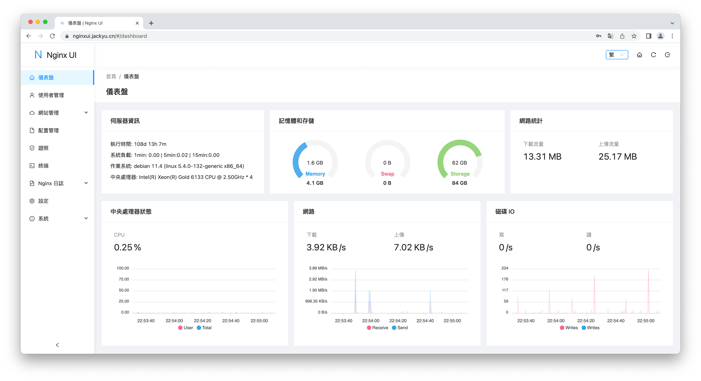

<div align="center">
      
</div>

# Nginx UI

Yet another Nginx Web UI

Nginx 網路管理介面，由  [0xJacky](https://jackyu.cn/) 與 [Hintay](https://blog.kugeek.com/) 開發。

[](https://github.com/0xJacky/nginx-ui/actions/workflows/build.yml)

[For English](README.md)

[简体中文](README-zh_CN.md)

<details>
  <summary>目錄</summary>
  <ol>
    <li>
      <a href="#關於專案">關於專案</a>
      <ul>
        <li><a href="#特色">特色</a></li>
        <li><a href="#國際化">國際化</a></li>
        <li><a href="#構建基於">構建基於</a></li>
      </ul>
    </li>
    <li>
      <a href="#入門指南">入門指南</a>
      <ul>
        <li><a href="#使用前注意">使用前注意</a></li>
        <li><a href="#安裝">安裝</a></li>
        <li>
          <a href="#使用方法">使用方法</a>
          <ul>
            <li><a href="#透過執行檔案執行">透過執行檔案執行</a></li>
            <li><a href="#使用-systemd">使用 Systemd</a></li>
          </ul>
        </li>
      </ul>
    </li>
    <li>
      <a href="#手動構建">手動構建</a>
      <ul>
        <li><a href="#依賴">依賴</a></li>
        <li><a href="#構建前端">構建前端</a></li>
        <li><a href="#構建後端">構建後端</a></li>
      </ul>
    </li>
    <li>
      <a href="#linux-安裝指令碼">Linux 安裝指令碼</a>
      <ul>
        <li><a href="#基本用法">基本用法</a></li>
        <li><a href="#更多用法">更多用法</a></li>
      </ul>
    </li>
    <li><a href="#nginx-反向代理配置示例">Nginx 反向代理配置示例</a></li>
    <li><a href="#貢獻">貢獻</a></li>
    <li><a href="#開源許可">開源許可</a></li>
  </ol>
</details>

## 關於專案



### 在线预览

网址：[https://nginxui.jackyu.cn](https://nginxui.jackyu.cn)

- 用户名：admin
- 密码：admin

### 特色

- 線上檢視伺服器 CPU、記憶體、系統負載、磁碟使用率等指標
- 一鍵申請和自動續簽 Let's encrypt 證書
- 線上編輯 Nginx 配置檔案，編輯器支援 Nginx 配置語法高亮
- 使用 Go 和 Vue 開發，發行版本為單個可執行的二進位制檔案
- 前端支援暗夜模式
- 保存配置文件後自動測試配置文件並重載 Nginx

### 國際化

- 英語
- 簡體中文
- 繁體中文

我們歡迎您將專案翻譯成任何語言。

### 構建基於

- [The Go Programming Language](https://go.dev/)
- [Gin Web Framework](https://gin-gonic.com)
- [GORM](http://gorm.io/index.html)
- [Vue 2](https://vuejs.org)
- [vue-gettext](https://github.com/Polyconseil/vue-gettext)

## 入門指南

### 使用前注意

Nginx UI 遵循 Nginx 的標準，建立的網站配置檔案位於 Nginx 配置目錄（自動檢測）下的 `sites-available` 目錄，啟用後的網站的配置檔案將會建立一份軟連線到 `sites-enabled`目錄中。因此，您可能需要提前調整配置檔案的組織方式。

### 安裝

Nginx UI 可在以下平臺中使用：

- Mac OS X 10.10 Yosemite 及之後版本（amd64 / arm64）
- Linux 2.6.23 及之後版本（x86 / amd64 / arm64 / armv5 / armv6 / armv7 / armv8）
  - 包括但不限於 Debian 7 / 8、Ubuntu 12.04 / 14.04 及後續版本、CentOS 6 / 7、Arch Linux
- FreeBSD
- OpenBSD
- Dragonfly BSD
- Openwrt

您可以在 [最新發行 (latest release)](https://github.com/0xJacky/nginx-ui/releases/latest) 中下載最新版本，或使用 [Linux 安裝指令碼](#scripts-for-linux).

### 使用方法

第一次執行 Nginx UI 時，請在瀏覽器中訪問 `http://<your_server_ip>:<listen_port>/install` 完成後續配置。

#### 透過執行檔案執行
**在終端中執行 Nginx UI**

```shell
nginx-ui -config app.ini
```
在終端使用 `Control+C` 退出 Nginx UI。

**在後臺執行 Nginx UI**

```shell
nohup ./nginx-ui -config app.ini &
```
使用以下命令停止 Nginx UI。

```shell
kill -9 $(ps -aux | grep nginx-ui | grep -v grep | awk '{print $2}')
```
#### 使用 Systemd
如果你使用的是 [Linux 安裝指令碼](#scripts-for-linux)，Nginx UI 將作為 `nginx-ui` 服務安裝在 systemd 中。請使用 `systemctl` 命令控制。

**啟動 Nginx UI**

```shell
systemctl start nginx-ui
```
**停止 Nginx UI**

```shell
systemctl stop nginx-ui
```
**重啟 Nginx UI**

```shell
systemctl restart nginx-ui
```
## 手動構建

對於沒有官方構建版本的平臺，可以嘗試手動構建。

### 依賴

- Make

- Golang 1.17+

- node.js 14+

  ```shell
  npx browserslist@latest --update-db
  ```

### 構建前端

請在 `frontend` 目錄中執行以下命令。

```shell
yarn install
make translations
yarn build
```

### 構建後端

請先完成前端編譯，再回到專案的根目錄執行以下命令。

```shell
go build -o nginx-ui -v main.go
```

## Linux 安裝指令碼

### 基本用法

**安裝或升級**

```shell
bash <(curl -L -s https://raw.githubusercontent.com/0xJacky/nginx-ui/master/install.sh) install
```
一鍵安裝指令碼預設設定的監聽埠為 `9000`，HTTP Challenge 埠預設為 `9180`，如果出現埠衝突請進入 `/usr/local/etc/nginx-ui/app.ini` 修改，並使用 `systemctl restart nginx-ui` 重啟 Nginx UI 服務。

**解除安裝 Nginx UI 但保留配置和資料庫檔案**

```shell
bash <(curl -L -s https://raw.githubusercontent.com/0xJacky/nginx-ui/master/install.sh) remove
```

### 更多用法

````shell
bash <(curl -L -s https://raw.githubusercontent.com/0xJacky/nginx-ui/master/install.sh) help
````

## Nginx 反向代理配置示例

```nginx
server {
    listen          80;
    listen          [::]:80;

    server_name     <your_server_name>;
    rewrite ^(.*)$  https://$host$1 permanent;
}

server {
    listen  443       ssl http2;
    listen  [::]:443  ssl http2;

    server_name         <your_server_name>;

    ssl_certificate     /path/to/ssl_cert;
    ssl_certificate_key /path/to/ssl_cert_key;

    location / {
        proxy_set_header    Host                $host;
        proxy_set_header    X-Real-IP           $remote_addr;
        proxy_set_header    X-Forwarded-For     $proxy_add_x_forwarded_for;
        proxy_set_header    X-Forwarded-Proto   $scheme;
        proxy_http_version  1.1;
        proxy_set_header    Upgrade             $http_upgrade;
        proxy_set_header    Connection          upgrade;
        proxy_pass          http://127.0.0.1:9000/;
    }
}
```

## 貢獻

貢獻使開源社群成為學習、啟發和創造的絕佳場所。我們**非常感謝**您所做的任何貢獻。

如果您有讓這個專案變得更強的建議，歡迎 fork 這個倉庫並建立一個 Pull Request。您也可以建立一個帶有 `enhancement` （加強）標籤的 Issue。最後，不要忘記給我們的專案點個 Star！再次感謝！

1. Fork 專案
2. 建立您的分支 (`git checkout -b feature/AmazingFeature`)
3. 提交您的修改 (`git commit -m 'Add some AmazingFeature'`)
4. 推送到您的分支 (`git push origin feature/AmazingFeature`)
5. 建立一個 Pull Request

## 開源許可

此專案基於 GNU Affero Public License v3.0 (AGPLv3) 許可，請參閱 [LICENSE](LICENSE) 檔案。透過使用、分發或對本專案做出貢獻，表明您已同意本許可證的條款和條件。
